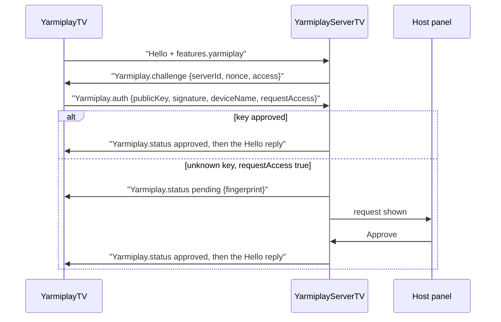

# YarmiplayTV device access prompt

This is a self-contained prompt for an agent working in the **YarmiplayTV** client repository. It describes
how YarmiplayServerTV (1.6.0 and later) admits approved devices, and the client work needed to support it.
It builds on the extension handshake in [client-integration-prompt.md](client-integration-prompt.md) (file
relay and Jellyfin sharing); both use the same opt-in and the same detection rules. Paste everything below
the line into the agent.

---

## Goal

YarmiplayServerTV is a Syncplay 1.7 server (it reports `realversion` 1.7.6). Its host chooses who can join:

- **open:** anyone.
- **passwordOnly:** the Syncplay password, for everyone. Device keys aren't checked, so there is no
  challenge; an approved device needs the password too.
- **password:** the Syncplay password, or a device the host approved.
- **approved:** only devices the host approved. Official Syncplay clients are refused.

A YarmiplayTV device proves who it is with an ECDSA P-256 key pair it creates for that server. The host sees
the request in the server's control panel, compares a short code with the one YarmiplayTV shows, and approves
or denies it. Once approved, the device joins without a password from then on.

Add this to YarmiplayTV without changing anything when the server is a stock Syncplay server, or a
YarmiplayServerTV in **vanilla Syncplay mode** (which behaves exactly like a stock server and must be treated
as one).

## Hard rules

- **Never send a `Yarmiplay` command unless the server sent one first** (or its Hello reply carried
  `features.yarmiplay.server == "YarmiplayServerTV"`). A stock Syncplay server drops the connection with an
  error on unknown commands. The only extension data the client sends unprompted is the `yarmiplay` entry in
  its Hello `features`, which stock servers ignore.
- The private key never leaves the device: non-exportable on Android, an owner-only file on desktop.
- Use a separate key for each `serverId`, and validate `serverId` (exactly 32 lowercase hex characters) before
  using it in a key alias or file name.
- The password still goes into the Hello as it does today (MD5 hex, the Syncplay way). An approved key just
  makes it unnecessary.

## Protocol (extension protocol 1)

### Hello

Add the opt-in to the Hello `features` (the same entry the relay work uses):

```json
{"Hello": {"username": "ana", "password": "<md5 hex, if the user entered one>",
  "room": {"name": "movie night"}, "version": "1.2.255", "realversion": "1.7.6",
  "features": {"sharedPlaylists": true, "chat": true,
               "yarmiplay": {"protocol": 1, "client": "YarmiplayTV", "version": "<app version>"}}}}
```

### When the server challenges

The server answers a Hello with a challenge instead of the Hello reply only when **all** of these hold:

- vanilla mode is off,
- the access mode is `password` or `approved`,
- the Hello carried `features.yarmiplay`.

Otherwise it answers as it does today: in `open` mode, the Hello reply comes straight away, and in
`passwordOnly` mode (or `password` mode without the opt-in) a stock-style password check applies: the Hello
reply, or `Password required` / `Wrong password supplied` and a closed connection.



**Challenge** (server to client):

```json
{"Yarmiplay": {"challenge": {"protocol": 1, "serverId": "9b1f0c2e4d6a8b0c1e3f5a7b9c0d2e4f",
  "nonce": "q83vEjRWeJA0Vni8mY7cE3A2m9vLz5n0kQ1y8f3dXeM=", "access": "approved"}}}
```

**Auth reply** (client to server), within **30 seconds**:

```json
{"Yarmiplay": {"auth": {"publicKey": "MFkwEwYHKoZIzj0CAQYIKoZIzj0DAQcDQgAE…",
  "signature": "MEUCIQ…", "deviceName": "Living room TV", "requestAccess": true}}}
```

- `publicKey`: base64 (standard alphabet, with padding) of the X.509 SubjectPublicKeyInfo DER. Java's
  `PublicKey.getEncoded()` returns exactly this for an EC key. It must be P-256 (`id-ecPublicKey` with
  `prime256v1`); the DER starts with the bytes `3059301306072a8648ce3d020106082a8648ce3d030107034200`.
- `signature`: base64 of the DER ECDSA signature (`Signature.getInstance("SHA256withECDSA")` output) over the
  UTF-8 bytes of:

  ```
  YarmiplayServerTV-device-auth-v1\n{serverId}\n{nonce}
  ```

  with `\n` a single line feed and `{nonce}` the base64 string exactly as received.
- `deviceName`: shown to the host; at most 60 characters are kept.
- `requestAccess`: `true` to ask the host when the key isn't approved yet. Send `false` for a silent check
  (for example a background reconnect), and `true` when the user chose to connect or tapped **Request
  access**.

**Fingerprint:** SHA-256 of the SubjectPublicKeyInfo DER; the first 16 hex digits in uppercase, in groups
of four: `3F2A-91BC-04DE-7710`. Show it while waiting so the user can read it to the host, who sees the same
code in the panel.

### Status messages

`{"Yarmiplay": {"status": {"state": "<state>", "fingerprint": "3F2A-91BC-04DE-7710"}}}`

| `state` | What follows |
| --- | --- |
| `approved` | The normal Hello reply (then the `Yarmiplay` session message from the relay work). |
| `pending` | Nothing yet. The server holds the connection for up to 10 minutes and repeats this status every 60 seconds as a keepalive. |
| `denied` | An `Error`, then the connection closes. The host said no. |
| `expired` | An `Error`, then the connection closes. Nobody answered within 10 minutes. |
| `required` | An `Error`, then the connection closes. The key isn't approved and `requestAccess` was `false`. |
| `revoked` | Sent while logged in, when the host removes the device. An `Error` follows and the connection closes. |

Other outcomes are a plain `{"Error": {"message": ...}}` and a closed connection:

- `Device authentication failed`: bad signature, wrong key type or a malformed `auth`.
- `Device authentication timed out`: no `auth` within 30 seconds.
- `Too many devices are waiting for approval; try again later`: the server's request limits (3 waiting
  requests per IP address, 50 in total).
- In `approved` mode, a Hello without `features.yarmiplay` gets: `This server only admits devices approved by
  the host. Connect with YarmiplayTV and request access.`

### Password mode in detail

1. The client sends the Hello (with the password if the user has one) and answers the challenge.
2. If the key is approved: `status approved` and the Hello reply, whatever the password.
3. If not, the server checks the Hello's password:
   - correct: the Hello reply follows directly, **without** a status message. The marker says
     `"device": "none"`.
   - missing or wrong, with `requestAccess: true`: `status pending`, as in approved mode.
   - missing or wrong, with `requestAccess: false`: the official error, `Password required` or `Wrong password
     supplied`.

### Detection marker

When the client's Hello carried `features.yarmiplay` and vanilla mode is off, the Hello reply's `features`
include:

```json
"yarmiplay": {"server": "YarmiplayServerTV", "version": "1.6.0", "protocol": 1,
  "capabilities": {"fileRelay": true, "jellyfin": false, "https": false},
  "access": "password", "device": "approved"}
```

`access` is `open`, `passwordOnly`, `password` or `approved`; `device` is `approved` when this login used an
approved key and `none` otherwise (always `none` in `passwordOnly`). Vanilla clients and vanilla mode never
get this entry.

When the host switches to `passwordOnly`, logins that used an approved key instead of the password get
`Password required` and the connection closes. Logins that used the password stay.

## Telling the servers apart

Keep a `serverKind` per connection: `Unknown` until the server answers, then:

- `YarmiplayServerTV` if the client received any `Yarmiplay` message or the Hello reply has
  `features.yarmiplay.server == "YarmiplayServerTV"`;
- `Syncplay` in every other case, including YarmiplayServerTV in vanilla mode.

With `Syncplay`, hide all device UI, use only the password flow, and never send a `Yarmiplay` command.
Remember the last kind and `serverId` per saved server profile, so the connect screen can show the right
fields next time (for example, hide the password field for a server known to be in `approved` mode, and
keep it visible for `passwordOnly`).

## Client changes

**`syncplay-protocol`** (`SyncplayClient.kt`, `Models.kt`), kept pure Kotlin:

- A `DeviceAuth` interface passed in through `SyncplayConfig`:
  - `deviceName: String`
  - `publicKey(serverId): ByteArray` (SubjectPublicKeyInfo DER)
  - `sign(serverId, message: ByteArray): ByteArray` (DER ECDSA)
- Add the `yarmiplay` entry to the Hello `features`.
- Handle `Yarmiplay.challenge` before the Hello reply: sign and answer with `auth`. Decide `requestAccess`
  from the connection's intent (user-initiated or **Request access**: `true`; automatic reconnect: `false`).
- Handle `Yarmiplay.status`, compute the fingerprint, and expose the device state.
- `RoomState` gets `serverKind` and the device state (`None`, `Pending(fingerprint)`, `Approved`, `Denied`,
  `Expired`, `Required`, `Revoked`). Add `SyncplayEvent`s for pending, approved, denied, expired, required
  and revoked.
- Don't time out the Hello wait while the state is `Pending` (the keepalive arrives every 60 seconds; treat
  about 90 seconds of silence as a lost connection).
- Don't reconnect automatically after `denied`, `required` or `revoked`, or after `expired` (offer a retry
  button instead).

**`shared`**: an expect/actual `DeviceKeyStore`.

- **Android:** AndroidKeyStore, a non-exportable EC key per server, alias `yarmiplay-device-<serverId>`:
  `KeyGenParameterSpec.Builder(alias, PURPOSE_SIGN).setAlgorithmParameterSpec(ECGenParameterSpec("secp256r1")).setDigests(DIGEST_SHA256)`.
  Sign with `Signature.getInstance("SHA256withECDSA")`. This works from API 23, so minSdk 26 is fine.
- **Desktop:** a JCA `secp256r1` key pair per server, saved as PKCS#8 DER at
  `<app data>/device-keys/<serverId>.p8` (or under `data/` in portable mode). Create the file owner-only
  (POSIX `rw-------`; on Windows the per-user app data folder).
- **Device name:** on Android, `Settings.Global.DEVICE_NAME`, falling back to `Build.MODEL`; on desktop, the
  hostname. Let the user change it in settings.
- **"Forget this device's key"** for a server deletes the key, so the next connection makes a new one and
  needs approval again.
- DataStore keeps each profile's `serverId` and last `serverKind`.

**UI** (`SyncplayConnectScreen.kt`, `MobileConnect.kt`, `ConnectModels.kt`):

- **Pending:** "Waiting for the host to approve this device", with the fingerprint in large type, the device
  name, and a **Cancel** button (which closes the connection).
- **Required:** "This device isn't approved on this server", with a **Request access** button (reconnects
  with `requestAccess: true`).
- **Denied / Expired / Revoked:** a clear message and a manual **Try again**.
- Hide the password field once the server is known to be in `approved` mode.
- A status line on the room screen: "YarmiplayServerTV · approved device", "YarmiplayServerTV · password"
  (both password modes), or nothing for stock servers.
- Profile settings: **Forget this device's key**.

**Docs:** update `docs/privacy.md` in YarmiplayTV: the app creates a key per server, and sends the server its
public key, the device name and the username. The private key stays on the device.

## Tests

- **Unit tests:**
  - The signed message bytes and the fingerprint format. Check a signature from `DeviceKeyStore` against its
    own public key with JCA.
  - The SubjectPublicKeyInfo of a generated key starts with the P-256 prefix above.
  - `serverKind` detection: a `Yarmiplay` message, the marker, a stock Hello reply, and a vanilla-mode reply.
  - No `Yarmiplay` command is ever written to a connection whose `serverKind` is `Syncplay` or `Unknown`.
  - The state machine: pending keeps the connection alive past the normal Hello timeout; no automatic
    reconnect after denied, required or revoked.
- **Against YarmiplayServerTV with vanilla mode off.** Run the desktop app, or keep a test copy separate with
  `YARMIPLAYSERVERTV_HOME=<temp folder>`, then on its Syncplay page:
  - **Approved devices only:** connect, see the pending screen and the same code in the panel, approve, and
    land in the room. Reconnect: no approval needed. Deny a second device. Remove the first device while it's
    in a room: it sees "revoked".
  - **Password or approved devices:** an approved device joins without the password; an unapproved one
    joins with the right password; with a wrong password and **Request access** it goes to pending.
  - **Password only:** no challenge; an approved device without the password gets `Password required`, and
    with it joins with `"device": "none"`.
  - **Anyone:** no challenge; the marker shows `"access": "open"`.
- **Against the same server with vanilla mode on:** YarmiplayTV must see a plain Syncplay server (no device UI,
  password only), and must never send a `Yarmiplay` command.
- **Against the official Syncplay server** (`syncplay-server`): the same as vanilla mode; with and without a
  password.
